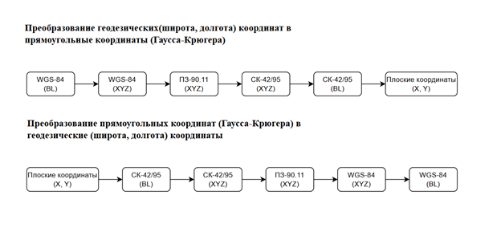

# ConsoleGPS — Библиотека и консольная утилита для преобразования геодезических координат

Данный проект представляет собой консольное приложение на C#, предназначенное для преобразования геодезических координат между различными системами (датумами) и проекциями. В основе лежат алгоритмы, соответствующие стандартам (в частности, ГОСТ 32453-2017).

## Ссылка на репозиторий где лежит оконное приложение для тестирования этой библиотеки
**https://github.com/Voevodkin-Daniil/WindowedCoordinateDetectionWGS84**


## Источники
- https://racurs.ru/downloads/documentation/gost_r_32453-2017.pdf?ysclid=m74cniwn8633815025
- https://earth.google.com/web/search/%d1%81%d0%b0%d0%bc%d0%b0%d1%80%d0%b0/@53.20114544,50.11298133,0a,416.59567164d,35y,-179.64702411h,62.33006212t,0r/data=CiwiJgokCWGLW2mU2E1AEdtcCUfnwBdAGXbs9e2UHmVAIQk49Zd5LF7AQgIIAjoDCgEwQgIIAEoICIjdks8CEAA?hl=ru&authuser=0
- https://geoproj.ru/


## Основные возможности

Проект позволяет выполнять следующие преобразования:

*   **Парсинг строковых представлений координат:**
    *   Преобразование из формата «Градусы Минуты Секунды» (например, `53°12'05.41"`) в десятичные градусы и обратно.
*   **Пересчет между геодезическими и декартовыми координатами:**
    *   Прямое и обратное преобразование для эллипсоидов WGS-84, ГСК-2011, ПЗ-90.11 и СК-42/95 (эллипсоид Красовского).
*   **Пересчет между различными геодезическими датумами (системами координат):**
    *   WGS-84 (G1150) <=> ПЗ-90.11
    *   ПЗ-90.11 <=> ГСК-2011
    *   ПЗ-90.11 <=> СК-42/95
*   **Проекция Гаусса-Крюгера:**
    *   Преобразование геодезических координат (WGS-84) в плоские прямоугольные координаты (зональная система СК-42/95).
    *   Обратное преобразование из плоских координат проекции Гаусса-Крюгера в геодезические координаты WGS-84.

Алгоритм преобразований равлизован по схеме:


## Структура проекта

Проект состоит из трех основных файлов:

1.  **`Program.cs`** — Демонстрационный пример использования. Показывает, как выполнить преобразование координат из градусов/минут/секунд в плоские координаты проекции Гаусса-Крюгера и обратно, а также проверяет сходимость результата.
2.  **`ParserGMS.cs`** — Статический класс для парсинга и форматирования координат.
    *   `ParseToDecimal()` — преобразует строку вида `"53°12'05.41"` в число с плавающей точкой.
    *   `ParseToDMS()` — преобразует десятичные градусы в строку формата DMS.
3.  **`TranslationWGS84.cs`** — Основной класс, содержащий всю математику преобразований.
    *   Содержит параметры референц-эллипсоидов.
    *   Реализует методы перевода геодезических координат в декартовы (геоцентрические) и обратно.
    *   Содержит методы преобразования между датумами на основе параметров из ГОСТ 32453-2017.
    *   Реализует прямую и обратную проекцию Гаусса-Крюгера.

## Используемые системы координат (Датумы)

В проекте используется перечисление `EncodingDatum`, которое включает:

*   `WGS_84` — Всемирная геодезическая система 1984 года.
*   `GSK_2011` — Российская государственная система координат 2011 года (ГСК-2011).
*   `PZ_90` — Российская геоцентрическая система координат «Параметры Земли 1990 года» (ПЗ-90.11).
*   `SK` — Система координат 1942 или 1995 года (СК-42/95) на эллипсоиде Красовского.

## Пример использования

Пример из `Program.cs` демонстрирует полный цикл преобразования:

1.  Исходные координаты задаются в формате DMS (широта и долгота).
2.  Преобразуются в радианы (геодезические WGS-84).
3.  Выполняется перевод в плоские координаты Гаусса-Крюгера (метры).
4.  Выполняется обратное преобразование из плоских координат в геодезические (радианы WGS-84).
5.  Результат выводится в консоль в исходном формате DMS, а также вычисляется разница между исходными и восстановленными плоскими координатами для проверки точности вычислений.

```csharp
// Пример вызова преобразования в проекцию Гаусса-Крюгера
double B = 53.325252 * Math.PI / 180.0;
double L = 50.332141 * Math.PI / 180.0;

var gaussKruegerCoords = TranslationWGS84.ConvertToGaussKrueger(B, L);
Console.WriteLine($"X: {gaussKruegerCoords.x}, Y: {gaussKruegerCoords.y}");
```
