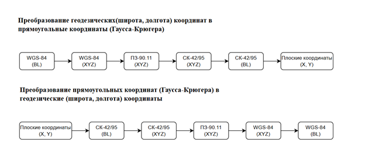

# ConsoleGPS — Библиотека и консольная утилита для геодезических вычислений

Проект представляет собой консольное приложение и библиотеку на C# для широкого спектра геодезических расчетов: преобразования координат между различными системами (датумами), проекциями, форматами. В основе лежат алгоритмы, соответствующие стандартам (в частности, ГОСТ 32453-2017).

## Ссылка на репозиторий с оконным приложением для тестирования этой библиотеки
[*Реализация в оконном приложении (WPF)*](https://github.com/Voevodkin-Daniil/WindowedCoordinateDetectionWGS84/ "Связанный проект")

## Источники
- **ГОСТ 32453-2017** — [racurs.ru](https://racurs.ru/downloads/documentation/gost_r_32453-2017.pdf?ysclid=m74cniwn8633815025)
- **Google Earth** — для проверки координат
- **Геодезический калькулятор** — [geoproj.ru](https://geoproj.ru/)
- **Local Tangent Plane Coordinates** — [PSAS Archive](https://archive.psas.pdx.edu/CoordinateSystem/Latitude_to_LocalTangent.pdf)

## Основные возможности

### 1. Парсинг и форматирование координат (`ParserGMS`)
*   **`ParseToDecimal()`** — преобразование из формата «Градусы Минуты Секунды» (например, `53°12'05.41"`, `53 12 5.41`) в десятичные градусы.
*   **`ParseToDMS()`** — обратное преобразование из десятичных градусов в строку формата DMS.

### 2. Пересчет между геодезическими и декартовыми координатами (`TranslationWGS84`)
*   Прямое и обратное преобразование для эллипсоидов:
    *   **WGS-84** (Всемирная геодезическая система)
    *   **ГСК-2011** (Государственная система координат РФ)
    *   **ПЗ-90.11** (Параметры Земли 1990 г.)
    *   **СК-42/95** (Система координат 1942/1995 г. на эллипсоиде Красовского)

### 3. Пересчет между различными геодезическими датумами (ГОСТ 32453-2017)
*   WGS-84 (G1150) <=> ПЗ-90.11
*   ПЗ-90.11 <=> ГСК-2011
*   ПЗ-90.11 <=> СК-42/95

### 4. Проекция Гаусса-Крюгера
*   **Прямое преобразование:** WGS-84 (геод.) → Прямоугольные координаты (зональная система СК-42/95, эллипсоид Красовского).
*   **Обратное преобразование:** Прямоугольные координаты (СК-42/95) → Геодезические координаты WGS-84.

### 5. Локальная касательная плоскость (ENU)
*   **`ConvertGeodeticToLocalTangent`** — перевод геодезических координат (WGS-84) в локальную топоцентрическую систему координат «Восток-Север-Вверх» (East-North-Up) относительно заданной опорной точки.
*   **`ConvertLocalTangentToGeodetic`** — обратное преобразование.

## Алгоритмическая схема преобразований датумов


## Структура проекта
*   **`Program.cs`** — Демонстрационный пример. Показывает:
    *   Преобразование координат в проекцию Гаусса-Крюгера и обратно.
    *   Расчет расстояний в локальной касательной плоскости.
    *   Триангуляцию цели на основе реальных данных.
*   **`ParserGMS.cs`** — Парсер форматов DMS и класс `TargetLocator` для триангуляции.
*   **`TranslationWGS84.cs`** — Основной класс геодезических преобразований.

## Пример использования (триангуляция)

```csharp
Console.WriteLine("Преобразование координат демонстрационный вариант");

(double B, double L, double H) OO1 = (53.2015043 * Math.PI / 180.0, 50.1133423 * Math.PI / 180.0, 0);

(double B, double L, double H) OO2 = (53.2000976 * Math.PI / 180.0, 50.1125830 * Math.PI / 180.0, 0);

// Сравнение насколько будет разница при двойном определении
test_1(OO1);

// Проерка что выдаст растояние
test_2(OO1, OO2);
test_3(OO2, OO1);

private static bool test_1((double B, double L, double H) Point)
{
    var temp = TranslationWGS84.ConvertToGaussKrueger(Point.B, Point.L);
    var point_1 = TranslationWGS84.ConvertFromGaussKrueger(temp.x, temp.y);

    var temp2 = TranslationWGS84.ConvertToGaussKrueger(point_1.B, point_1.L);

    Console.WriteLine(Math.Sqrt(Math.Pow(temp.x - temp2.x,2) + Math.Pow(temp.y - temp2.y, 2)));
    Console.WriteLine();

    return true;
}

private static bool test_2((double B, double L, double H) A, (double B, double L, double H) B)
{
    var temp_A = TranslationWGS84.ConvertToGaussKrueger(A.B, A.L);
    var temp_B = TranslationWGS84.ConvertToGaussKrueger(B.B, B.L);

    Console.WriteLine(Math.Sqrt(Math.Pow(temp_A.x - temp_B.x, 2) + Math.Pow(temp_A.y - temp_B.y, 2)));
    Console.WriteLine();

    return true;
}

private static bool test_3((double B, double L, double H) T, (double B, double L, double H) OO)
{
    var temp_T = TranslationWGS84.ConvertGeodeticToLocalTangent(T, OO);

    
    Console.WriteLine(Math.Sqrt(Math.Pow(temp_T.east, 2) + Math.Pow(temp_T.north, 2)));

    var T_new = TranslationWGS84.ConvertLocalTangentToGeodetic(temp_T, OO);
    Console.WriteLine($"{(T.B / Math.PI * 180):f7} \t {(T.L / Math.PI * 180):f7}");
    Console.WriteLine($"{(T_new.B / Math.PI * 180):f7} \t {(T_new.L / Math.PI * 180):f7}");
    Console.WriteLine();

    return true;
}

```